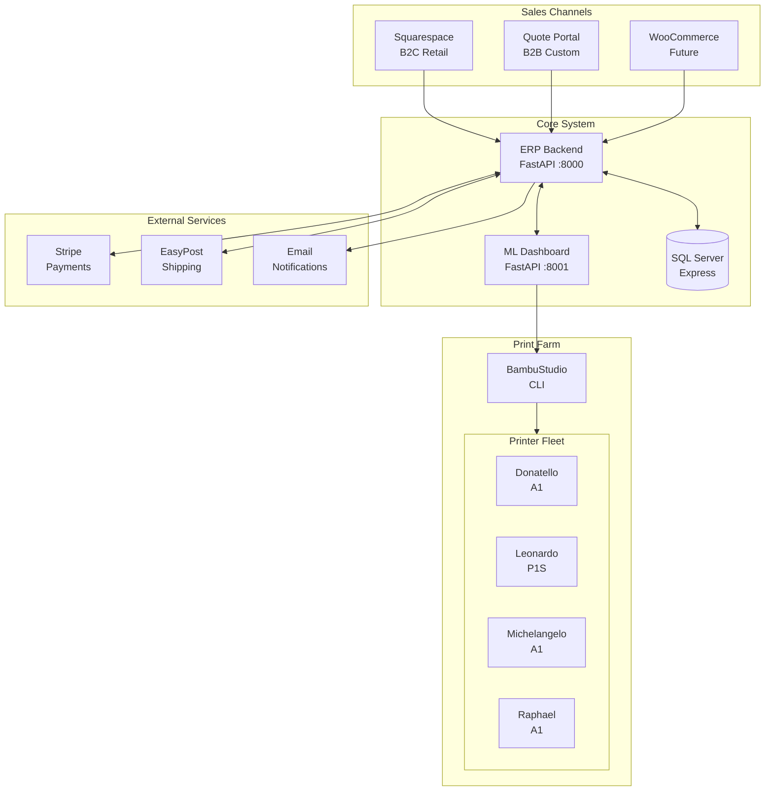
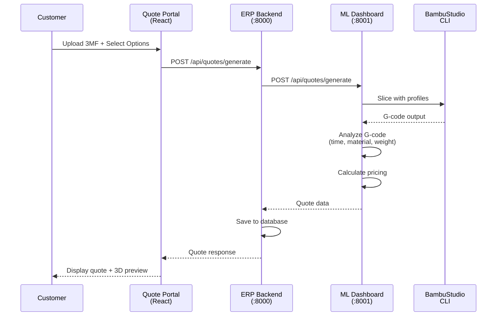
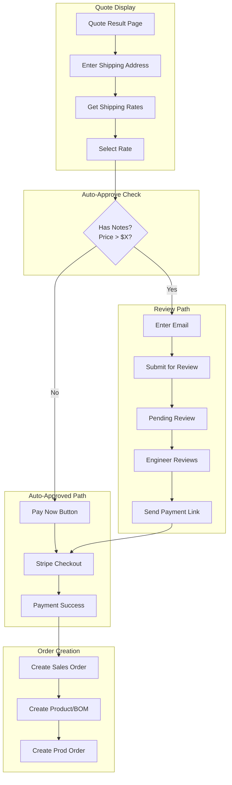
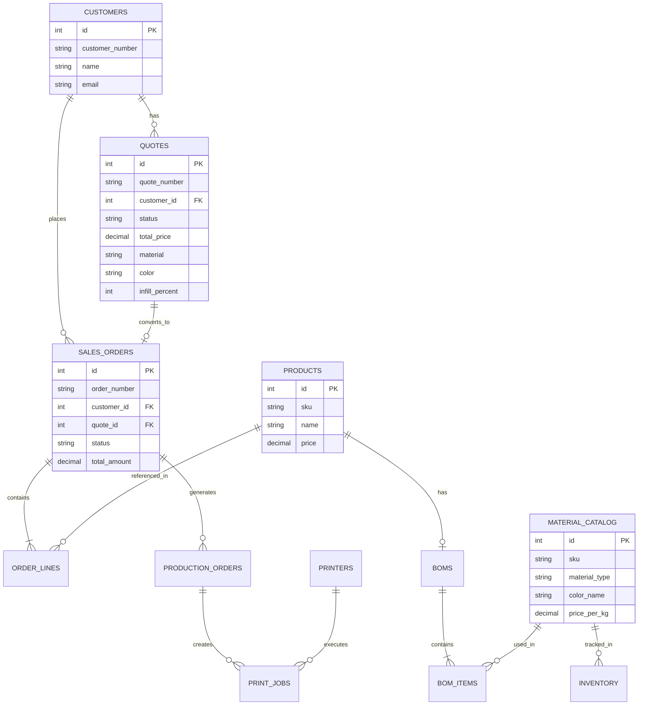
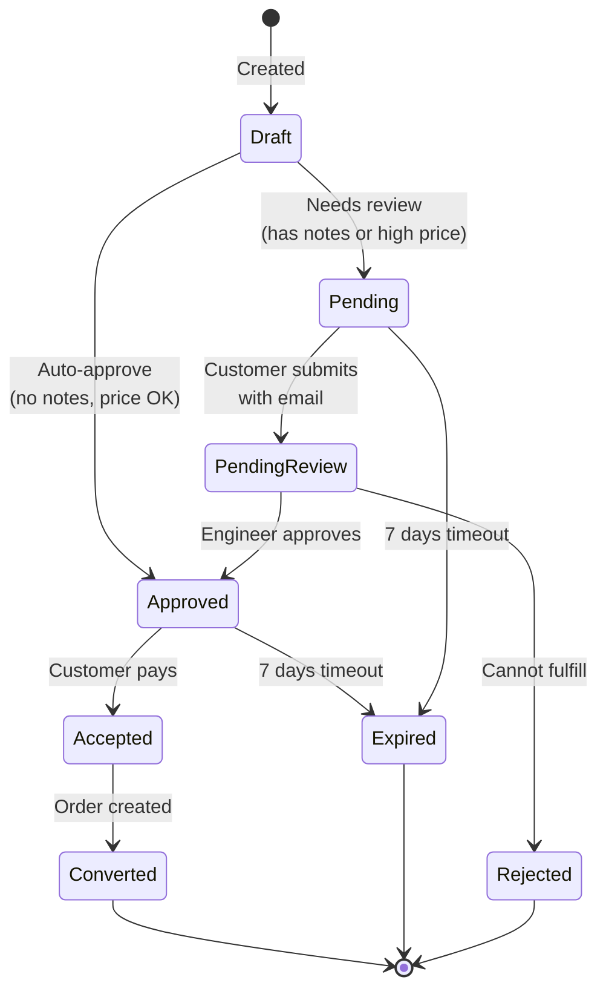
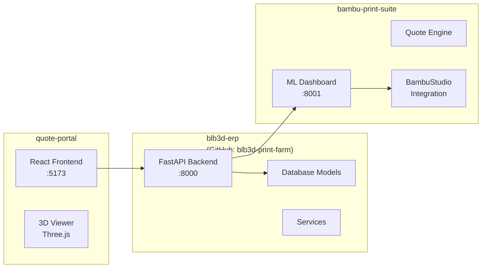
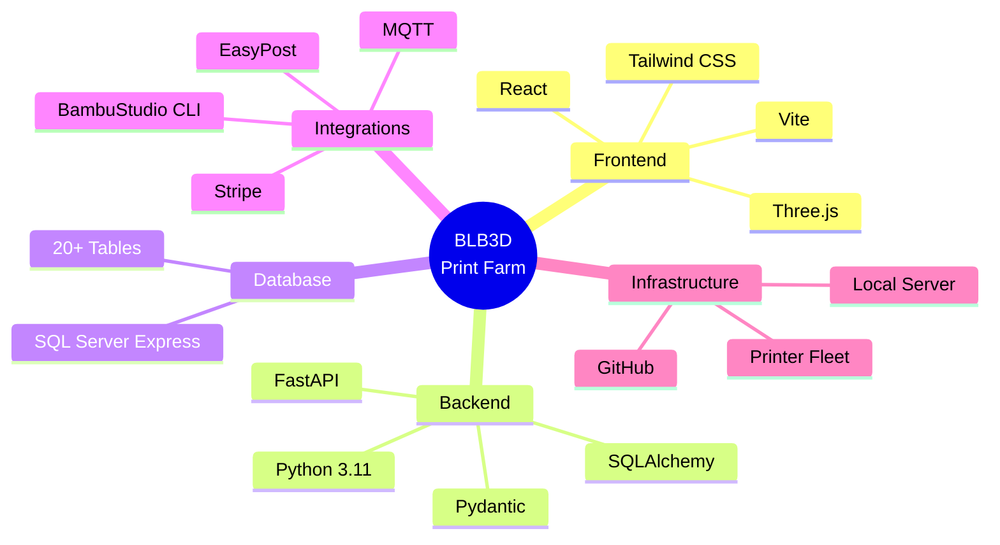
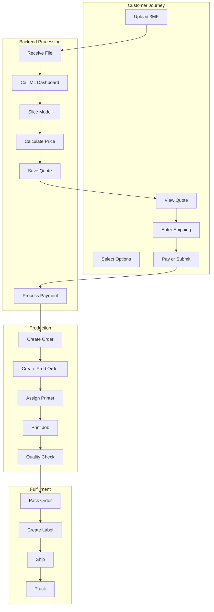

# BLB3D System Diagrams (Mermaid)

These diagrams render automatically in VS Code with the Mermaid extension, or view at https://mermaid.live

---

## 1. High-Level System Architecture

---

## 2. Quote Generation Flow

---

## 3. Payment Flow

---

## 4. Data Model (Simplified)

---

## 5. Quote Status State Machine

---

## 6. Repository Structure

---

## 7. Tech Stack Overview

---

## 8. Complete System Flow

---

## VS Code Setup

Install the **Markdown Preview Mermaid Support** extension:
1. Open Extensions (Ctrl+Shift+X)
2. Search for "Markdown Preview Mermaid Support"
3. Install by Matt Bierner
4. Open this file and press Ctrl+Shift+V to preview

Or use **Mermaid Preview** extension for side-by-side editing.
